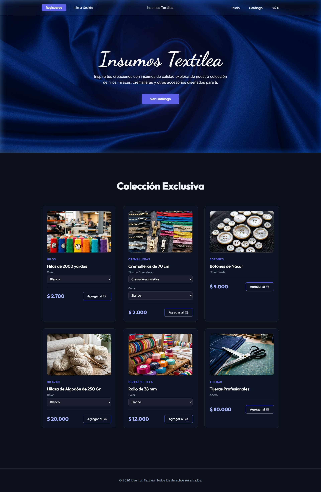

# Insumos Textilea - Premium

Sistema de gestión y catálogo exclusivo para una tienda de insumos textiles. Este proyecto integra un backend robusto en Spring Boot con un frontend moderno y dinámico diseñado para ofrecer una experiencia de usuario premium.

## 🚀 Vista Previa del Proyecto (Actualizada)

### Interfaz Completa y Catálogo Interactivos
La plataforma cuenta con un diseño unificado de alta fidelidad, con cabecera funcional, selectores dinámicos de color/tipo y precios actualizados en tiempo real.

## 🛠️ Tecnologías Utilizadas

*   **Frontend**: JavaScript (ES6+), Vite, HTML5, Vanilla CSS3.
*   **Backend**: Java, Spring Boot, Spring Data JPA, Hibernate.
*   **Base de Datos**: MySQL 9.5+.
*   **Diseño**: Google Fonts (Dancing Script, Outfit, Inter).

## 📸 Características Destacadas

*   **Diseño Premium**: Interfaz moderna con Glassmorphism y efectos de sombreado azul profundo.
*   **Catálogo Dinámico**: Conexión en tiempo real con base de datos MySQL.
*   **Interactividad en Precios**: El precio de las cremalleras se ajusta automáticamente según el tipo seleccionado (Metálica vs Estándar).
*   **Personalización**: Selectores de color en Hilos, Hilazas y Cintas con opción de entrada manual.

## ⚙️ Instrucciones para Ejecución Local

### Pasos:
1.  **Base de Datos**: Importar el archivo `database/schema.sql` en MySQL.
2.  **Configuración**: Ajustar las credenciales en `backend/src/main/resources/application.properties`.
3.  **Correr Backend**: Ejecutar `./gradlew bootRun` dentro de la carpeta `/backend`.
4.  **Correr Frontend**: Ejecutar `npm run dev` dentro de la carpeta `/frontend`.
5.  **Acceso**: Abrir `http://localhost:5173` en el navegador.

---
*Desarrollado como evidencia de progreso del proyecto de Insumos Textiles.*
