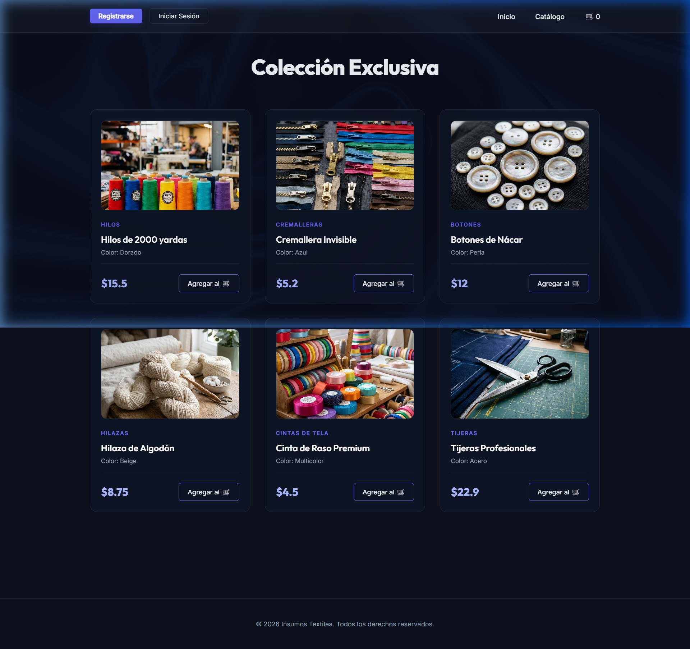
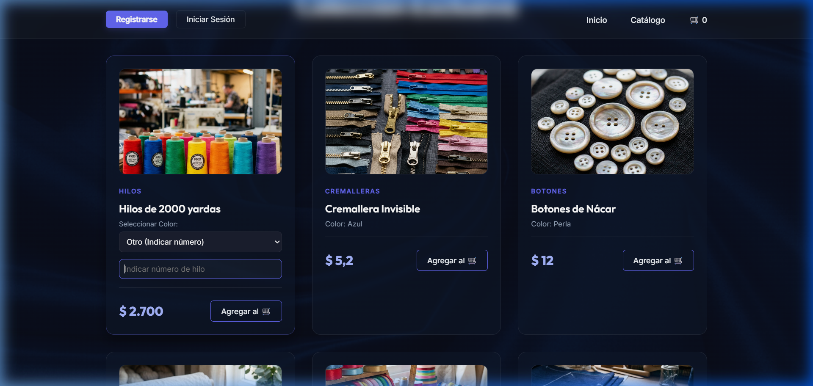

# Lumina Textiles - Insumos Premium

Sistema de gestión y catálogo exclusivo para una tienda de insumos textiles. Este proyecto integra un backend robusto en Spring Boot con un frontend moderno y dinámico diseñado para ofrecer una experiencia de usuario premium.

## 🚀 Vista Previa del Proyecto

### Características Destacadas:
*   **Diseño Premium**: Interfaz moderna con Glassmorphism y efectos de sombreado azul profundo sobre texturas de tela.
*   **Catálogo Dinámico**: Conexión en tiempo real con base de datos MySQL para mostrar productos actualizados.
*   **Gestión Detallada**: Los hilos cuentan con selectores de color dinámicos y soporte para tonos personalizados.
*   **Interacción Fluida**: Micro-animaciones y efectos de transición para una navegación suave.

## 🛠️ Tecnologías Utilizamos

*   **Frontend**: JavaScript (ES6+), Vite, HTML5, Vanilla CSS3.
*   **Backend**: Java, Spring Boot, Spring Data JPA, Hibernate.
*   **Base de Datos**: MySQL 9.5+.
*   **Diseño**: Google Fonts (Dancing Script, Outfit, Inter).

## 📸 Evidencia de Funcionalidad

### Selector de Color Inteligente
Los hilos permiten elegir colores básicos o especificar un número de tono exacto mediante un campo dinámico:

## ⚙️ Instrucciones para Ejecución Local

### Requisitos previos:
*   Java JDK 17+
*   MySQL Server
*   Node.js & npm

### Pasos:
1.  **Base de Datos**: Importar el archivo `database/schema.sql` en MySQL.
2.  **Configuración**: Ajustar las credenciales en `backend/src/main/resources/application.properties`.
3.  **Correr Backend**: Ejecutar `./gradlew bootRun` dentro de la carpeta `/backend`.
4.  **Correr Frontend**: Ejecutar `npm run dev` dentro de la carpeta `/frontend`.
5.  **Acceso**: Abrir `http://localhost:5173` en el navegador.

---
*Desarrollado como evidencia de progreso del proyecto de Insumos Textiles.*
